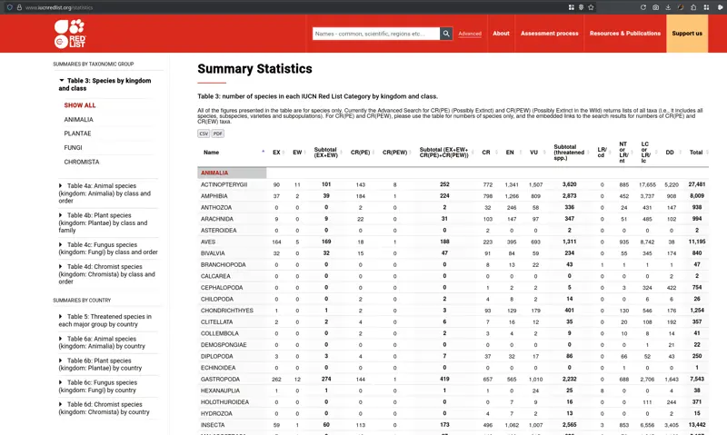
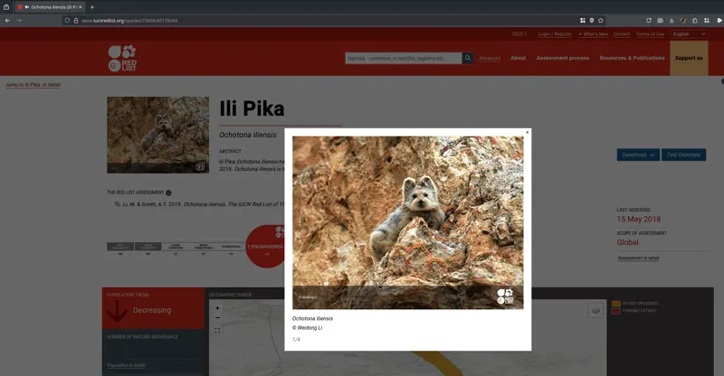
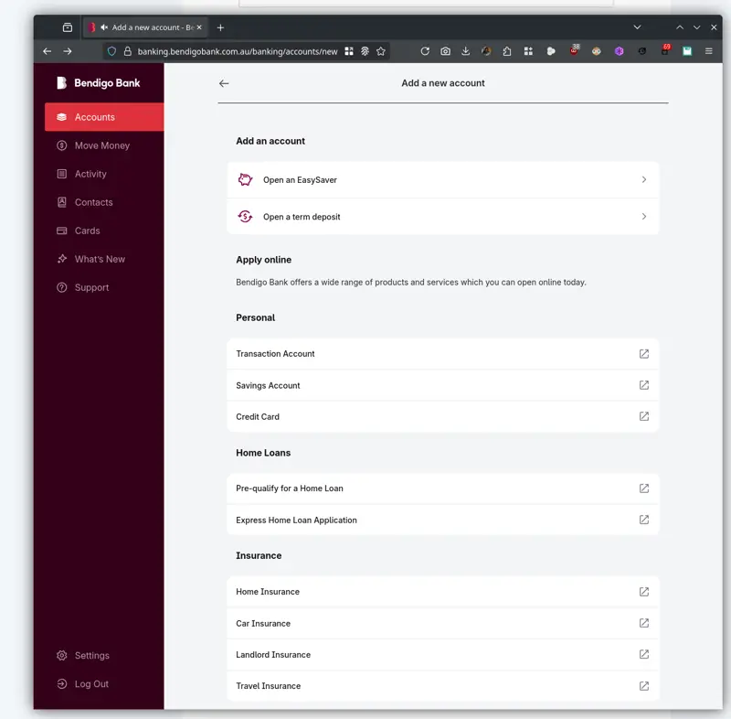

+++
title = "Projects"
type = "projects"
+++

## IUCN Red List

## Bendigo Bank

## disposable_email

An open-source Elixir library for blocking disposable email signups. It validates email addresses against a continuously updated list of known disposable email providers, helping applications prevent throwaway accounts at registration.

- **Language:** Elixir
- **Package:** [hex.pm/packages/disposable_email](https://hex.pm/packages/disposable_email)
- **Source:** [github.com/oshanz/disposable-email](https://github.com/oshanz/disposable-email)
